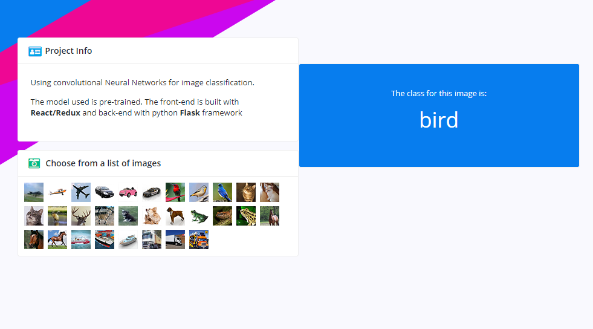

# convnet-redux
Convolutional Neural Networks with React/Redux Front-end and Flask back-end. 
You can view the demo [here](http://convnet-redux.s3-website.eu-west-2.amazonaws.com).
The pre-trained model and the Teonsorflow code is taken from  [Cristian Kaiser's repository](https://github.com/christiankaiser/cnn-cifar10-example.git ).
The flask way is adopted frome [Ahmed Gad's repository](https://github.com/ahmedfgad/CIFAR10CNNFlask ).
The set is standard, CIFAR-10 dataset.

## Run the project

To run the back-end api:

### `python server.py`

This runs the backend server on port 5000. 

In the client directory, you can run:

### `npm start`

Runs the app in the development mode. 
Open [http://localhost:3000](http://localhost:3000) to view it in the browser.

